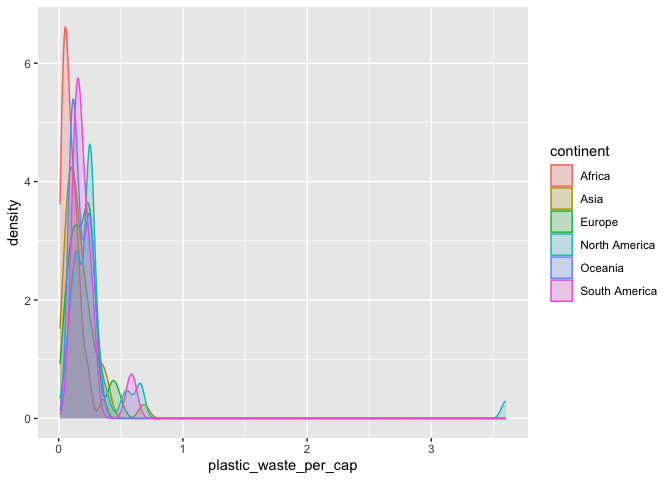

Lab 02 - Plastic waste
================
Olivia Zhang
1/27/2025

## Load packages and data

``` r
library(tidyverse) 
```

``` r
plastic_waste <- read.csv("data/plastic-waste.csv")
```

## Exercises

Examine the data.

``` r
ggplot(data = plastic_waste, aes(x = plastic_waste_per_cap)) +
  geom_histogram(binwidth = 0.2)
```

    ## Warning: Removed 51 rows containing non-finite outside the scale range
    ## (`stat_bin()`).

<!-- -->

Identify the outlier country.

``` r
plastic_waste %>%
  filter(plastic_waste_per_cap > 3.5)
```

    ##   code              entity     continent year gdp_per_cap plastic_waste_per_cap
    ## 1  TTO Trinidad and Tobago North America 2010    31260.91                   3.6
    ##   mismanaged_plastic_waste_per_cap mismanaged_plastic_waste coastal_pop
    ## 1                             0.19                    94066     1358433
    ##   total_pop
    ## 1   1341465

### Exercise 1

Distributions of plastic waste per capita for different continents.

``` r
ggplot(data = plastic_waste, aes(x = plastic_waste_per_cap)) +
  geom_histogram(binwidth = 0.2) +
  facet_wrap(~continent, ncol = 3)
```

    ## Warning: Removed 51 rows containing non-finite outside the scale range
    ## (`stat_bin()`).

<!-- -->

``` r
ggplot(
  data = plastic_waste,
  aes(x = plastic_waste_per_cap)
) +
  geom_density()
```

    ## Warning: Removed 51 rows containing non-finite outside the scale range
    ## (`stat_density()`).

<!-- -->

``` r
ggplot(
  data = plastic_waste,
  mapping = aes(
    x = plastic_waste_per_cap,
    color = continent
  )
) +
  geom_density()
```

    ## Warning: Removed 51 rows containing non-finite outside the scale range
    ## (`stat_density()`).

<!-- -->

``` r
ggplot(
  data = plastic_waste,
  mapping = aes(
    x = plastic_waste_per_cap,
    color = continent,
    fill = continent
  )
) +
  geom_density()
```

    ## Warning: Removed 51 rows containing non-finite outside the scale range
    ## (`stat_density()`).

<!-- -->

### Exercise 2

``` r
ggplot(
  data = plastic_waste,
  mapping = aes(
    x = plastic_waste_per_cap,
    color = continent,
    fill = continent
  )
) +
  geom_density(alpha = 0.2)
```

    ## Warning: Removed 51 rows containing non-finite outside the scale range
    ## (`stat_density()`).

<!-- -->

We define the color and fill of the curves by mapping aesthetics of the
plot because it would give us legends regarding which color/fill
represents which group, while there would be no legend for
characteristics that are mapped in the plotting geom, like in the case
of the alpha level.

### Exercise 3

``` r
ggplot(
  data = plastic_waste,
  mapping = aes(
    x = continent,
    y = plastic_waste_per_cap
  )
) +
  geom_boxplot()
```

    ## Warning: Removed 51 rows containing non-finite outside the scale range
    ## (`stat_boxplot()`).

<!-- -->

Now convert the side-by-side box plots from the previous task to violin
plots.

``` r
ggplot(
  data = plastic_waste,
  mapping = aes(
    x = continent,
    y = plastic_waste_per_cap
  )
) +
  geom_violin()
```

    ## Warning: Removed 51 rows containing non-finite outside the scale range
    ## (`stat_ydensity()`).

<!-- -->

The violin plots show the distributions of plastic waste per capita for
different continents, while the side-by-side box plots clearly tells us
about the means, quartiles, and outliers of plastic waste for different
continents, allowing straightforward comparisons of descriptive
statistics.

### Exercise 4

The relationship between plastic waste per capita and mismanaged plastic
waste per capita using a scatterplot is visualized below:

``` r
ggplot(
  data = plastic_waste,
  mapping = aes(
    x = plastic_waste_per_cap,
    y = mismanaged_plastic_waste_per_cap
  )
) +
  geom_point()
```

    ## Warning: Removed 51 rows containing missing values or values outside the scale range
    ## (`geom_point()`).

<!-- -->

As you can see here, the more the plastic waste per capita, the more
mismanaged plastic waste per capita. The trend going up is pretty steep,
which means that the positive correlation between the plastic waste per
capita and the more mismanaged plastic waste per capita is pretty
strong. However, there are also some variations of the trend, which
could represent data coming from different continents where the
strategies solving plastic waste is different, some more effective and
others not. And of course, there is one outlier.

``` r
ggplot(
  data = plastic_waste,
  mapping = aes(
    x = plastic_waste_per_cap,
    y = mismanaged_plastic_waste_per_cap, 
    color = continent
  )
) +
  geom_point()
```

    ## Warning: Removed 51 rows containing missing values or values outside the scale range
    ## (`geom_point()`).

<!-- -->

The color scatterplot reveals more information about how plastic waste
per capita and mismanaged plastic waste per capita are associated with
respect different continents. Africa seems to be the most inefficient
plastic waster handler. Europe and some Asian countries seems to be very
efficient in handling plastic waster, while others, North America, and
South America are somewhere in the middle.

``` r
ggplot(
  data = plastic_waste,
  mapping = aes(
    x = total_pop,
    y = plastic_waste_per_cap, 
    color = continent
  )
) +
  geom_point()
```

    ## Warning: Removed 61 rows containing missing values or values outside the scale range
    ## (`geom_point()`).

<!-- -->

``` r
ggplot(
  data = plastic_waste,
  mapping = aes(
    x = coastal_pop,
    y = plastic_waste_per_cap, 
    color = continent
  )
) +
  geom_point()
```

    ## Warning: Removed 51 rows containing missing values or values outside the scale range
    ## (`geom_point()`).

<!-- -->

### Exercise 5

Remove this text, and add your answer for Exercise 5 here.

``` r
# insert code here
```
